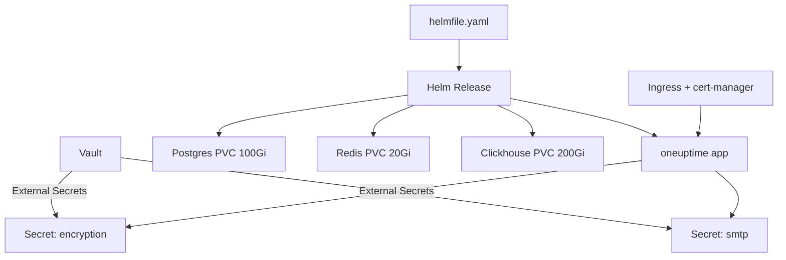

# OneUptime on Kubernetes via Helm

[](https://github.com/maxuver/oneuptime-k8s-helm/actions/workflows/ci.yml)
[](LICENSE)

GitOps-friendly deployment of self-hosted [OneUptime](https://github.com/oneuptime/oneuptime)
on a Kubernetes cluster: Helm values, External Secrets manifests, and a `helmfile.yaml`.

## Architecture



## Prerequisites

- Kubernetes 1.27+ with a default `StorageClass` (the example uses `rook-ceph-block`, replace as needed).
- [External Secrets Operator](https://external-secrets.io/) installed and a `ClusterSecretStore` named `vault-backend`.
- [cert-manager](https://cert-manager.io/) with a `ClusterIssuer` (the example uses `internal-ca`).
- [helmfile](https://github.com/helmfile/helmfile) installed (or use plain `helm`).

## Setup

```bash
# 1. Put secrets in Vault
vault kv put secret/oneuptime/encryption \
  encryptionKey="$(openssl rand -hex 32)" \
  jwtSecret="$(openssl rand -hex 32)"

vault kv put secret/oneuptime/smtp \
  host=smtp.example.com port=587 \
  username=oneuptime@example.com password=••••••••

# 2. Create the namespace and the ExternalSecret resources
kubectl apply -f manifests/

# 3. Apply the helmfile
helmfile -f helmfile.yaml apply
```

## Verification

```bash
kubectl -n oneuptime get pods,pvc,svc,ingress
kubectl -n oneuptime describe certificate oneuptime-tls | grep -i ready
curl -kI https://status.example.internal
```

## Files

```
.
├── helmfile.yaml
├── values/
│   └── oneuptime.values.yaml
└── manifests/
    ├── namespace.yaml
    ├── externalsecret-encryption.yaml
    └── externalsecret-smtp.yaml
```

## License

MIT — see [LICENSE](LICENSE).
